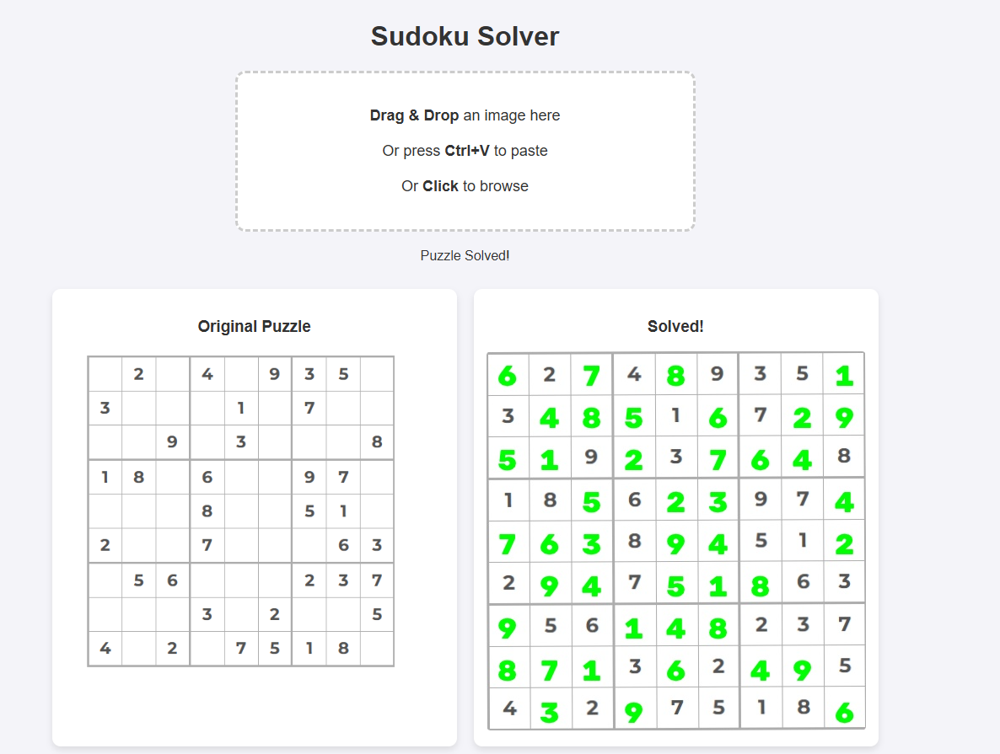
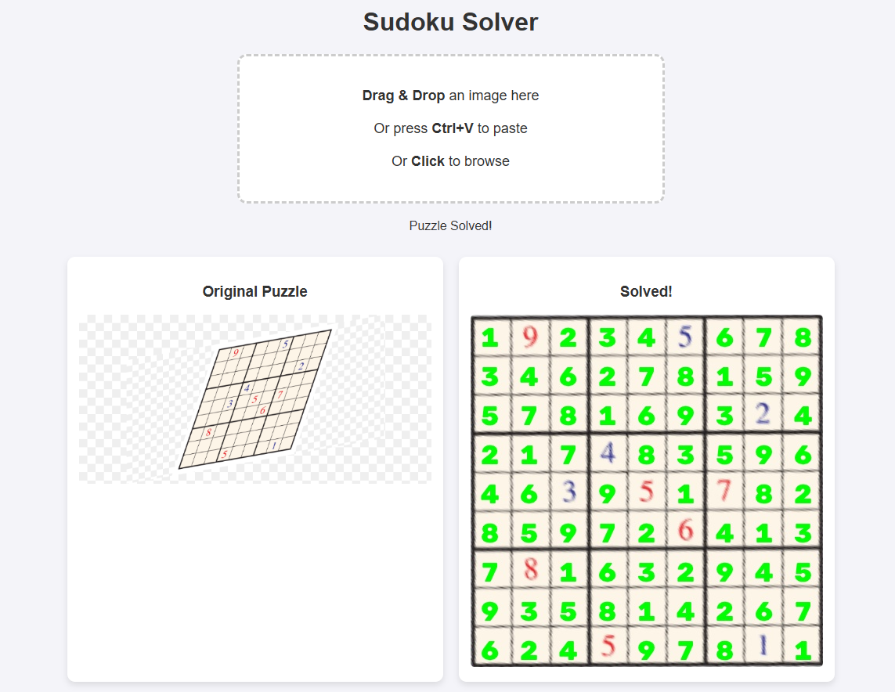

# Image Sudoku Solver

[](https://www.python.org/downloads/)
[](https://fastapi.tiangolo.com/)
[](https://www.docker.com/)
[](https://dvc.org/)
[](https://onnx.ai/)

An end-to-end Machine Learning web service designed to extract, recognize, and solve Sudoku puzzles from raw images. This project demonstrates full-stack ML engineering, from computer vision and deep learning inference to MLOps best practices (Data Version Control) and containerized API deployment.

---

## Showcase
#### Screenshots of the application in action for different inputs:

<table align="center">
  <tr>
    <td align="center" width="50%">
      
      <p>Clean input</p>
    </td>
    <td align="center" width="50%">
      
      <p>Skewed input</p>
    </td>
  </tr>
</table>

---

## Features

- **Computer Vision Pipeline:** Utilizes OpenCV for contour detection, perspective warping, and cell extraction.
- **Lightweight Deep Learning:** ONNX model for high-accuracy digit recognition without the heavy overhead of PyTorch/TensorFlow.
- **Robust Solving Algorithm:** Uses a backtracking algorithm to solve the parsed grid.
- **API:** Built with **FastAPI**, offering asynchronous endpoints.
- **MLOps Integrated:** Uses **DVC (Data Version Control)** to a secure Google Drive remote so Git doesn't track large files.
- **Containerized:** Fully Dockerized for easy deployment across environments.

---

## Architecture & Technologies

### Backend & API
* **[FastAPI](https://fastapi.tiangolo.com/)**
* **[Uvicorn](https://www.uvicorn.org/)**

### Machine Learning & Vision
* **[OpenCV](https://opencv.org/):** Image processing, grid detection, and perspective transformation.
* **[ONNX Runtime](https://onnxruntime.ai/):** Minimalist inference engine for digit classification.
* **[NumPy](https://numpy.org/)**

### MLOps & Infrastructure
* **[DVC](https://dvc.org/):** Data version control via Google Drive
* **[Docker](https://www.docker.com/)**

---

## Project Structure

```text
├── app/
│   ├── core/           # Sudoku solving logic
│   └── vision/         # OpenCV grid extraction and preprocessing, model definition and prediction
├── frontend/           # Frontend files
├── models/             # ONNX model
├── screenshots/        # Screenshots of the application in action
├── scripts/            # Helper scripts (training, model conversion)
├── tests/              # Test (Currently only for opencv vision)
├── data/               # Sudoku image dataset (Git-ignored, tracked by DVC)
├── main.py             # FastAPI endpoints and entry point
├── Dockerfile          # Container configuration
├── docker-compose.yml  # Not necessary, only so you can use docker compose up
├── requirements.txt    # Python dependencies
└── data.dvc            # DVC pointer mapping to Google Drive storage
```

---

## How to run the application locally

1. **Clone the Repository**
   ```bash
   git clone https://github.com/lekli-1/image-sudoku-solver.git
   ```

2. **Build the Docker Image**
   ```bash
   docker compose up --build
   ```
3. **Use the Application**
   - Open your browser and navigate to `http://localhost:8000`